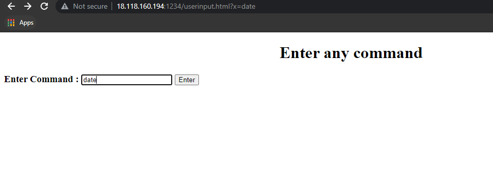
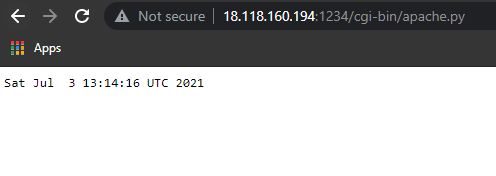

# Devops_Project

# to share between cgi-bin and backend promming file

docker run -itd --name project -p 1234:80 -v /home/ubuntu/docker/webcode:/var/www/html/ -v /home/ubuntu/docker/webbackend:/var/www/cgi-bin/ cento:p1

## after type  date command

