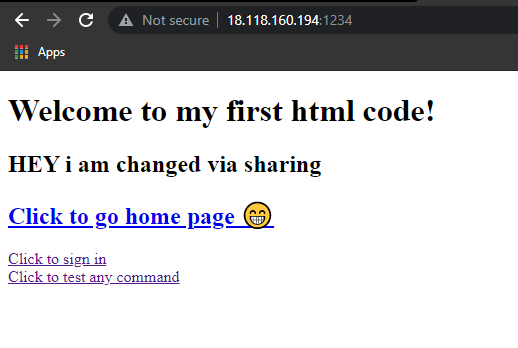
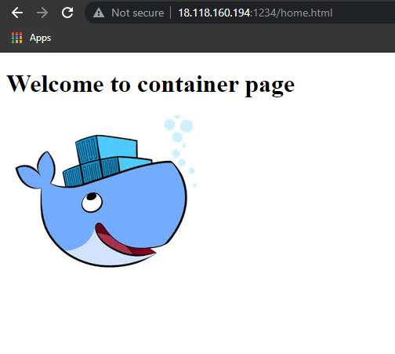
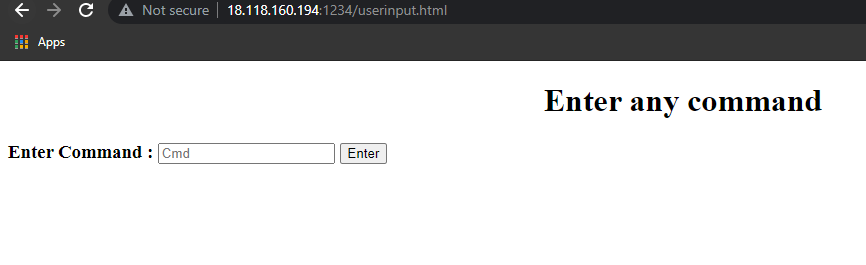

# Devops_Project

## After create a docker file from centos 

docker build -t cento:v1

docker run -itd --name project -p 18.118.160.194:123 cento:v1

docker ps
```
  ubuntu@ip-172-31-16-251:~/docker$ docker ps
CONTAINER ID   IMAGE      COMMAND                  CREATED       STATUS       PORTS                                   NAMES
4f08e536f3a8   cento:p1   "/bin/sh -c 'httpd -…"   2 hours ago   Up 2 hours   0.0.0.0:1234->80/tcp, :::1234->80/tcp   project

```
## After creating html files

docker rm project -f  // force fully remove project image

# sharing between html file and apache webserver

docker run -itd --name project -p 1234:80 -v /home/ubuntu/docker/webcode:/var/www/html/ cento:p1


## output






